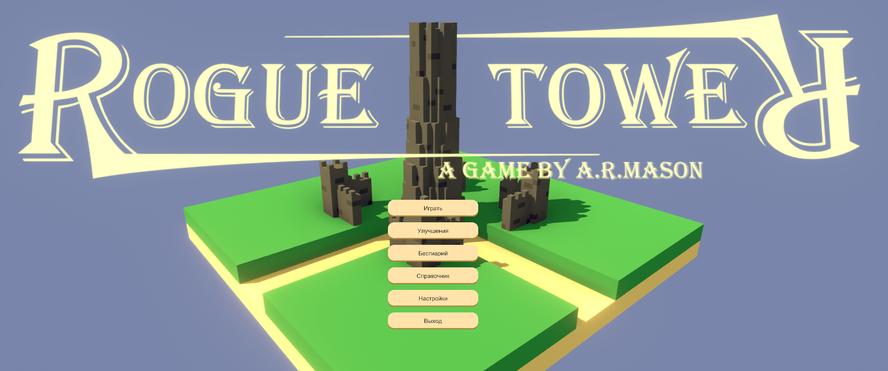
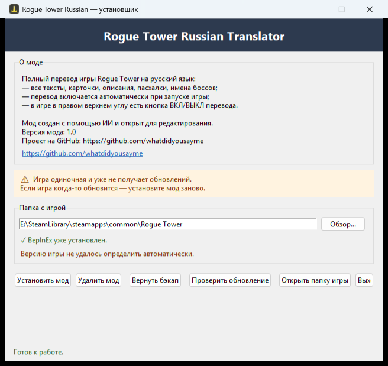
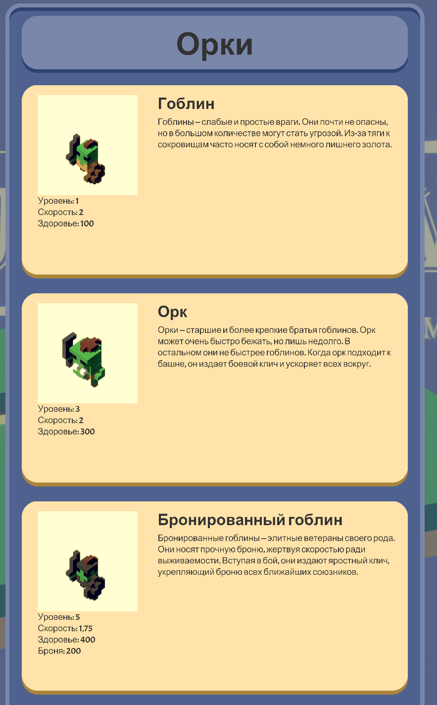
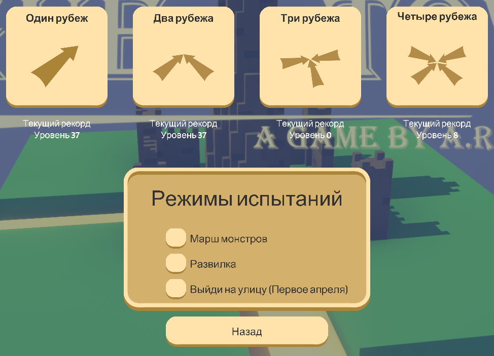
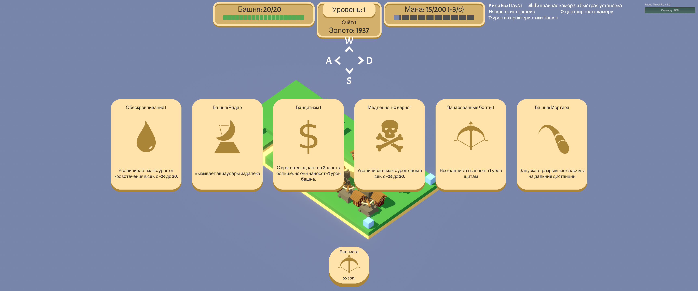

# 🌐 Rogue Tower Russian — руссификатор

Русская локализация для игры **Rogue Tower** (Steam, App ID `1843760`).

Перевод включает: тексты, карточки, описания, пасхалки, имена боссов. Мод создан с помощью ИИ, открыт для редактирования и дополнений.


[](https://github.com/whatdidyousayme/Rogue-Tower-Russian/releases/latest)

---

## 📸 Скриншоты

| Главное меню | Установщик |
|---|---|
|  |  |

| Бестиарий | Режимы испытаний |
|---|---|
|  |  |

| Карточки улучшений в бою | |
|---|---|
|  | |

---

## ✨ Что делает мод

- Полный перевод игры на русский: все тексты, карточки, описания, пасхалки, имена боссов.
- Перевод включается автоматически при запуске игры (BepInEx).
- В правом верхнем углу экрана — кнопка **«Перевод: ВКЛ/ВЫКЛ»** для мгновенного переключения на английский/русский.
- Настройка запоминается между запусками.
- Открытый для редактирования словарь (`translations.json`).

---

## 🚀 Установка (быстро)

Самый простой способ — скачать готовый **установщик**:

1. Скачайте `RogueTowerRussian_Installer.exe` со страницы [**Releases**](https://github.com/whatdidyousayme/Rogue-Tower-Russian/releases/latest) (или из папки `mod_installer/dist`).
2. Запустите его — установщик сам найдёт папку игры (или укажите вручную).
3. Нажмите **«Установить мод»**:
   - установит BepInEx, если его нет;
   - скопирует файлы мода в `BepInEx\plugins`;
   - создаст эталонную копию в `BepInEx\plugins\_backup`;
   - оставит исходники в папке `RogueTowerRussian_sources`.
4. Запустите игру через Steam — перевод включится автоматически.

> Интернет не нужен: BepInEx уже встроен в установщик.

---

## 🛠 Сборка из исходников

Нужен Python 3.x и установленный `pyinstaller`.

```bat
:: 1) Собрать мод (RogueTowerRussian.dll)
python build_mod32.py

:: 2) Собрать установщик (RogueTowerRussian_Installer.exe)
cd mod_installer
python build_installer.py
```

Готовый установщик появится в `mod_installer\dist\`.

---

## 📂 Структура проекта

```
Rogue Tower/
├── build_mod32.py              # сборка мода (RogueTowerRussian.dll)
├── mod_installer/
│   ├── mod_installer.py        # GUI-установщик (tkinter)
│   ├── build_installer.py      # сборка установщика (PyInstaller)
│   ├── icon.ico                # иконка (жёлтая башня)
│   └── dist/                   # готовый установщик .exe
├── TranslatorPlugin.cs         # исходник плагина BepInEx
├── translations.json           # словарь переводов
├── icon.ico                    # иконка проекта
└── changelog.txt               # история изменений
```

---

## 💬 Сообщить о проблеме

Пользователи могут писать о проблемах мода прямо на GitHub — для этого есть
раздел **Issues**:

`https://github.com/whatdidyousayme/Rogue-Tower-Russian/issues`

Описывая проблему, укажите: что случилось, где (экран), английский оригинал,
версию игры и прикрепите скриншот.

> ⚠️ Если Issues выключены — включите их: *Settings → General → Features → Issues*.

---

## 💬 Обсуждения (GitHub Discussions)

Для вопросов и идей (не для багов) есть раздел **Discussions**:

`https://github.com/whatdidyousayme/Rogue-Tower-Russian/discussions`

---

## 📝 Редактирование перевода

- Словарь переводов лежит в `BepInEx\plugins\translations.json` — его можно править.
- Чтобы вернуться к исходному — нажмите **«Вернуть бэкап»** в установщике.

---

## 🔒 Важно про обновления

Игра одиночная и уже не получает обновлений. Но если игра когда-то обновится — просто установите мод заново (накатите поверх).

---

## 📄 Лицензия

Проект распространяется под лицензией [MIT](LICENSE).

## 🙏 Автор

[whatdidyousayme](https://github.com/whatdidyousayme) · GitHub: [https://github.com/whatdidyousayme/Rogue-Tower-Russian](https://github.com/whatdidyousayme/Rogue-Tower-Russian)