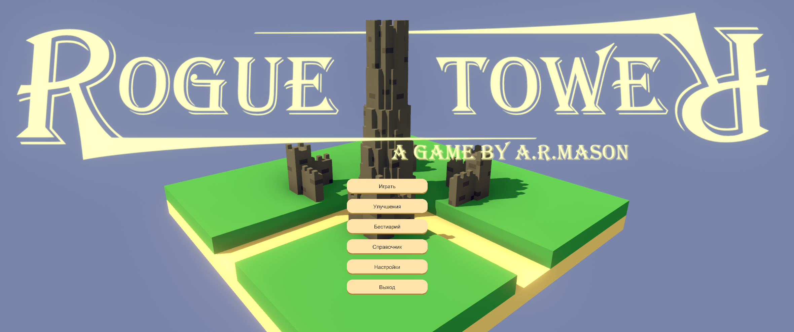
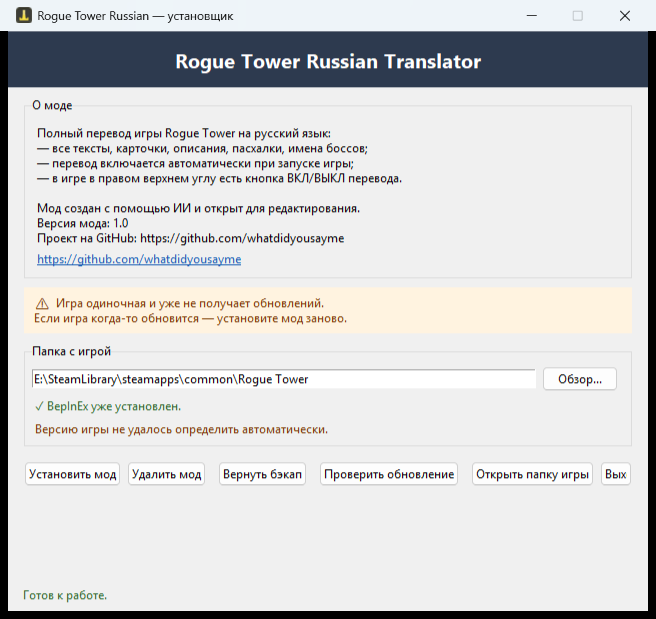
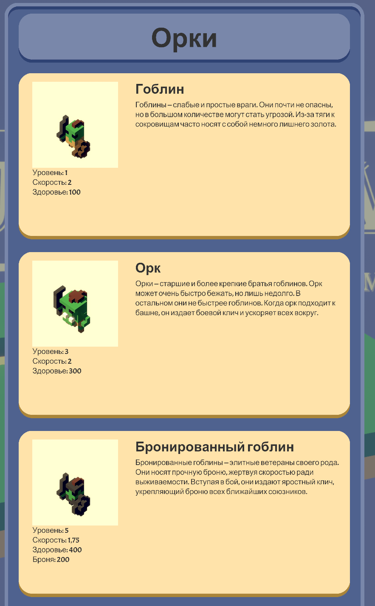
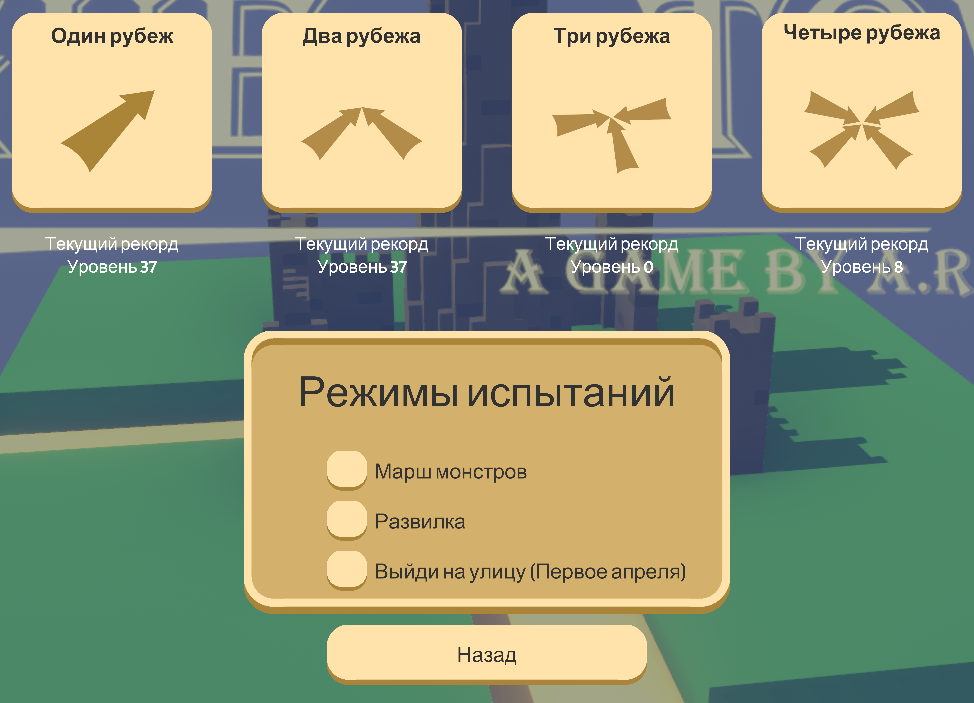
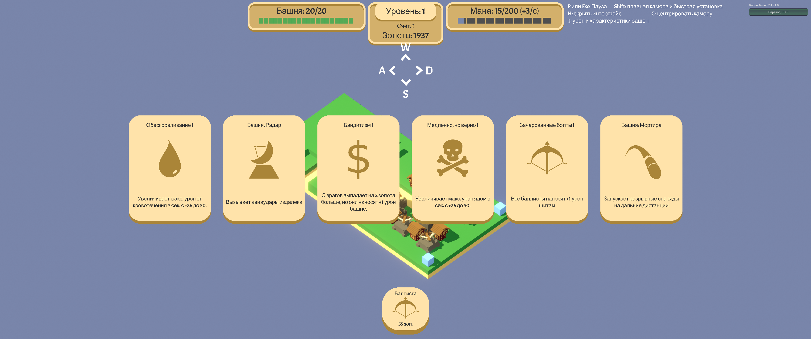

# Rogue Tower Russian 1.3

Перевод Rogue Tower на русский язык: меню, карточки, улучшения, бестиарий, подсказки и статистика. Для Steam-версии игры 1.3.2.0 на Windows.

## Как установить

1. [Скачайте архив установщика](https://github.com/whatdidyousayme/Rogue-Tower-Russian/releases/download/v1.3/Translate.Rogue.Tower.v.1.3.zip) и распакуйте его.
2. Закройте игру и запустите **RogueTowerRussian_Installer.exe**.
3. Выберите папку с **Rogue Tower.exe** и нажмите **«Установить мод»**.
4. Запустите игру через Steam — перевод включится автоматически.

**BepInEx и всё необходимое установятся автоматически. Отдельно скачивать ничего не нужно; интернет для установки не требуется.** При обновлении старую версию удалять не нужно.

## Возможности

- **«Перевод: ВКЛ/ВЫКЛ»** справа вверху — переключение между русским и английским прямо в игре.
- **«Масштаб текста»** под кнопкой — настройка размера от **50 до 140%**. Текст подстраивается под размеры кнопок и панелей.
- Выбранный язык и масштаб сохраняются между запусками.

Чтобы удалить перевод, закройте игру и нажмите **«Удалить мод»** в установщике.

## Скриншоты

| Главное меню | Установщик |
|---|---|
|  |  |

| Бестиарий | Режимы испытаний |
|---|---|
|  |  |

Карточки улучшений в бою:

[Сообщить о проблеме](https://github.com/whatdidyousayme/Rogue-Tower-Russian/issues) · [Для разработчиков](DEVELOPMENT.md) · [Лицензия MIT](LICENSE)
